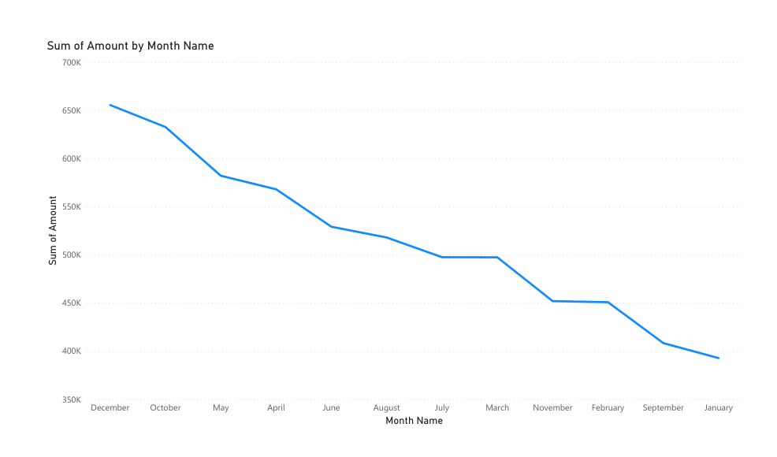
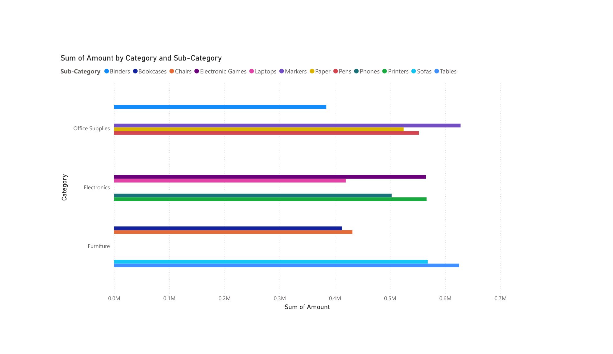
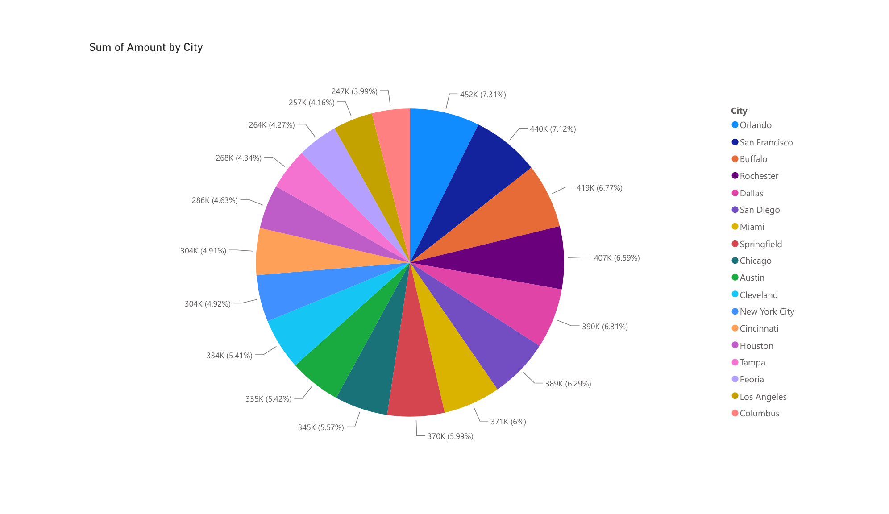
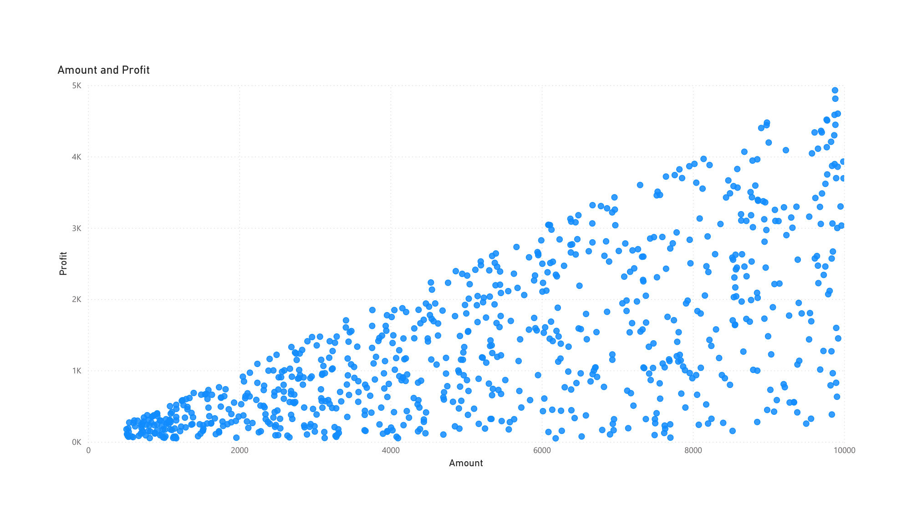

# 📊 Interactive Power BI Dashboard

An interactive business intelligence dashboard developed with **Microsoft Power BI** to explore, visualize, and analyze sales data. This project demonstrates the complete workflow of transforming raw data into meaningful insights through data cleaning, modeling, and interactive visualizations.

---

## 📌 Project Overview

The objective of this project is to build an interactive dashboard that enables users to explore sales performance from different perspectives. The dashboard provides visual summaries of sales trends, product categories, geographical distribution, and profitability while allowing interactive filtering for deeper analysis.

The project was developed as part of a Data Mining course and focuses on applying business intelligence concepts using Microsoft Power BI.

---

## 🎯 Objectives

- Transform raw sales data into an interactive dashboard
- Perform data cleaning and preprocessing
- Create meaningful visualizations for business analysis
- Identify sales trends and performance indicators
- Present insights in an intuitive and interactive format

---

## 🛠 Technologies Used

- Microsoft Power BI
- Power Query
- DAX
- Data Visualization
- Business Intelligence

---

## 📂 Repository Structure

```
interactive-powerbi-dashboard/
│
├── dashboard.pbix
├── README.md
├── report.pdf
│
└── images/
    ├── dashboard1.png
    ├── dashboard2.png
    ├── dashboard3.png
    └── dashboard4.png
```

---

## 📈 Dashboard Features

The dashboard includes several interactive pages for data exploration, including:

- Sales Overview
- Monthly Sales Trend
- Category and Subcategory Analysis
- Geographical Sales Distribution
- Sales vs Profit Analysis
- Interactive Filters and Slicers

---

## 🖼 Dashboard Preview

### Dashboard 1



---

### Dashboard 2



---

### Dashboard 3



---

### Dashboard 4



---

## 📊 Key Insights

The dashboard allows users to:

- Monitor overall sales performance
- Compare product categories and subcategories
- Analyze sales across different regions
- Identify relationships between sales and profit
- Explore trends through interactive filtering

---

## 🚀 Skills Demonstrated

- Data Cleaning
- Data Transformation
- Dashboard Design
- Business Intelligence
- Interactive Data Visualization
- Exploratory Data Analysis (EDA)
- KPI Visualization
- Power BI Development

---

## 📁 Files

| File | Description |
|------|-------------|
| dashboard.pbix | Power BI project |
| report.pdf | Project report |
| images/ | Dashboard screenshots |

---

## 📬 Contact

If you have any questions or suggestions, feel free to reach out or open an issue.
